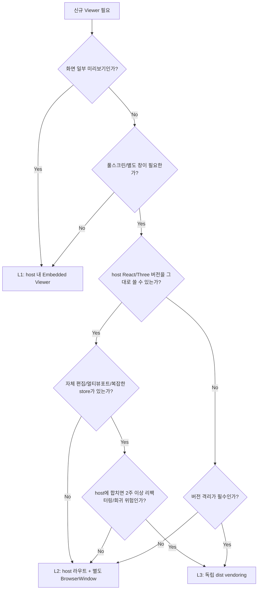

# HiTess WorkBench Viewer 관리 전략

## 목적

HiTess WorkBench에는 이미 여러 3D Viewer가 존재하고, 향후 해석 메뉴별 전용 Viewer가 계속 추가될 가능성이 높다. 모든 Viewer를 독립 React/Vite 프로젝트로 분리하면 빌드 시간, EXE 용량, React/Three.js 중복 런타임, 보안 패치, UX 일관성 관리 비용이 선형으로 증가한다.

이 문서는 신규 Viewer를 도입할 때 **host 내부 컴포넌트**, **host 라우트 기반 풀스크린 창**, **독립 vendoring Viewer** 중 어떤 방식으로 만들지 빠르게 판단하기 위한 기준을 정의한다.

전제 조건:

- WorkBench는 Electron + React(Vite) 데스크톱 앱이다.
- Electron 보안 설정은 유지한다: `contextIsolation: true`, preload 화이트리스트 IPC.
- 사내망 또는 인터넷 차단 환경을 고려한다.
- 새 Viewer 추가 시 기존 코드 수정량을 최소화한다.
- React 18/19, Three.js 버전 차이는 통합 방식의 핵심 트레이드오프로 명시한다.

---

## 1. Viewer 등급 분류

### 등급 요약

| 등급 | 이름 | 정의 | 권장 통합 방식 | 코드 위치 |
|---|---|---|---|---|
| L1 | Embedded Viewer | 화면 일부에 들어가는 가벼운 3D 표시 컴포넌트 | host 내 React 컴포넌트 | `src/components/viewers/`, `src/components/analysis/` |
| L2 | Workbench Viewer | host 데이터/상태를 공유하되 풀스크린 또는 별도 창이 필요한 작업형 Viewer | host 라우트 + 별도 BrowserWindow | `src/pages/viewers/`, `src/components/viewerShell/` |
| L3 | App-grade Viewer | 자체 앱에 가까운 대형 도구. 독립 빌드/상태/릴리즈 필요 | 독립 프로젝트 dist vendoring + 별도 BrowserWindow | `vendor/viewers/<viewerName>/`, `public/ModelAlgorithmViewer/` |

### L1. Embedded Viewer

**정의**

기존 WorkBench 화면 안에서 결과를 확인하거나 미리보기 용도로 사용하는 작은 Viewer다. 자체 라우팅, 복잡한 편집 상태, 독립 배포 단위가 필요하지 않다.

**판단 기준**

- 화면 일부 패널 또는 탭 안에 들어간다.
- host의 React, Zustand/Context, Tailwind, Three.js 버전을 그대로 써도 된다.
- 상태가 단순하다: 선택, 카메라, 표시 옵션 정도.
- 파일 저장, 장시간 편집, 멀티 뷰포트, 독립 워크플로우가 없다.

**예시**

- `BeamModelPreview.jsx`
- 간단한 BDF preview
- 결과 요약용 3D 미니맵

**권장 위치**

```text
src/components/viewers/
src/components/analysis/<domain>/
src/hooks/useThreeScene.js
```

공통 Three.js 초기화는 `useThreeScene.js`를 우선 사용한다.

### L2. Workbench Viewer

**정의**

작업 화면은 크고 독립적이지만, 기술적으로는 host 앱의 일부로 유지하는 Viewer다. 풀스크린 보조 창이 필요할 수 있으나 React/Three.js 런타임과 디자인 시스템은 host와 공유한다.

**판단 기준**

- 풀스크린 또는 별도 BrowserWindow가 필요하다.
- host의 인증, 프로젝트, 파일 경로, 사내 백엔드 `9091` API와 강하게 연결된다.
- Viewer 자체 컴포넌트 수는 중간 규모다.
- 독립 릴리즈보다 WorkBench 릴리즈와 함께 가는 것이 자연스럽다.
- React/Three.js 버전을 host와 맞출 수 있다.

**예시**

- `BdfModelViewer.jsx`의 풀스크린 확장판
- `AssessmentBdfViewer.jsx` 고도화 버전
- 해석 결과 검토 전용 Viewer

**권장 위치**

```text
src/pages/viewers/<ViewerName>Page.jsx
src/components/viewers/<ViewerName>/
src/components/viewerShell/FullscreenViewerShell.jsx
src/ipc/viewerIpc.js
```

L2는 새 Viewer의 기본값이다. 별도 창은 만들되 앱 번들 안에서 라우트만 분리한다.

### L3. App-grade Viewer

**정의**

Viewer가 사실상 별도 애플리케이션인 경우다. 자체 편집 모드, 멀티 뷰포트, 복잡한 상태 관리, 독립 테스트/배포, host와 다른 React/Three.js 버전 요구가 있을 때 선택한다.

**판단 기준**

- 자체 Zustand store, 30개 이상의 전용 컴포넌트, 독립 라우팅 또는 워크플로우가 있다.
- 편집 intent, import/export, 충돌 검증, 멀티 뷰포트 등 복잡한 도구성을 가진다.
- host 코드에 직접 합치면 리팩터링 비용과 회귀 위험이 크다.
- React 18/19, Three.js 버전 충돌 가능성이 있다.
- 단기간 통합이 필요하고, 장기적으로 일반화할 수 있다.

**예시**

- `HiTess Model Studio`
- 향후 별도 앱으로도 실행 가능한 대형 후처리/모델 편집 Viewer

**권장 위치**

```text
vendor/viewers/model-studio/
public/ModelAlgorithmViewer/
resources/viewers/<viewerName>/dist/
```

L3는 예외로 취급한다. “크니까 분리”가 아니라, **독립성이 비용보다 큰 경우**에만 선택한다.

---

## 2. 신규 Viewer 도입 의사결정 트리

### Rule of Thumb

> host의 React/Three.js와 UX를 공유할 수 있으면 L1/L2로 만들고, Viewer가 자체 앱처럼 동작해야 할 때만 L3로 분리한다.

### 5분 결정 트리



### 빠른 체크리스트

| 질문 | Yes면 |
|---|---|
| 패널 안 미리보기인가? | L1 |
| 별도 창이 필요하지만 host 디자인/상태를 공유 가능한가? | L2 |
| 자체 앱 수준의 편집/검증/스토어가 있는가? | L2 또는 L3 검토 |
| React/Three.js 버전 충돌이 실제로 있는가? | L3 가능 |
| host 통합 리팩터링이 단기 목표를 위협하는가? | L3 가능 |
| 독립 릴리즈/독립 실행이 필요한가? | L3 |

---

## 3. 풀스크린 보조 창 IPC 표준

### 원칙

- preload에서 허용한 IPC만 사용한다.
- renderer가 임의 채널을 호출하지 못하게 한다.
- 새 Viewer마다 채널을 늘리지 않고, 기본은 `mode` 필드로 분기한다.
- 보안 권한, 생명주기, 데이터 스트리밍 방식이 완전히 다를 때만 새 채널을 만든다.

### 권장 채널

| 채널 | 방향 | 용도 |
|---|---|---|
| `viewer:open` | renderer -> main | 풀스크린 Viewer 창 열기 |
| `viewer:init` | main -> viewer window | 초기 payload 전달 |
| `viewer:update` | main/renderer -> viewer window | 데이터 갱신 |
| `viewer:command` | viewer window -> main | 저장, export, backend 요청 등 명령 |
| `viewer:close` | renderer/viewer -> main | 창 닫기 |

### Payload 스키마

```ts
type ViewerMode =
  | 'modelAlgorithm'
  | 'bdfReview'
  | 'assessment'
  | 'resultPost'

type ViewerOpenPayload = {
  mode: ViewerMode
  requestId: string
  title?: string
  projectId?: string
  source?: {
    type: 'files' | 'folder' | 'backend' | 'memory'
    paths?: string[]
    folderPath?: string
    endpoint?: string
  }
  data?: unknown
  options?: {
    fullscreen?: boolean
    readonly?: boolean
    initialStage?: number
    allowEdit?: boolean
  }
}
```

### 채널 추가 기준

기본은 `mode` 추가로 해결한다.

새 채널을 만드는 경우:

- 보안 권한이 다르다. 예: 파일 쓰기, 외부 프로세스 실행, 인증 토큰 접근.
- 데이터 전달 방식이 다르다. 예: 수백 MB 스트리밍, shared file handle, chunked transfer.
- 창 생명주기가 다르다. 예: long-running solver monitor.
- preload 화이트리스트를 분리해야 감사가 쉬워진다.

그 외에는 `viewer:open` + `mode` 분기로 유지한다.

### 예시 Payload

#### Model Algorithm Viewer

```json
{
  "mode": "modelAlgorithm",
  "requestId": "viewer-20260429-001",
  "title": "HiTess Model Builder - 모델 알고리즘",
  "projectId": "PJT-10042",
  "source": {
    "type": "folder",
    "folderPath": "D:\\HiTess\\projects\\PJT-10042\\model_algorithm"
  },
  "options": {
    "fullscreen": true,
    "allowEdit": true,
    "initialStage": -1
  }
}
```

#### BDF Review Viewer

```json
{
  "mode": "bdfReview",
  "requestId": "viewer-20260429-002",
  "title": "BDF Review",
  "source": {
    "type": "files",
    "paths": ["D:\\HiTess\\cases\\case01\\model.bdf"]
  },
  "options": {
    "fullscreen": true,
    "readonly": true
  }
}
```

#### Backend Result Viewer

```json
{
  "mode": "resultPost",
  "requestId": "viewer-20260429-003",
  "projectId": "PJT-10042",
  "source": {
    "type": "backend",
    "endpoint": "http://127.0.0.1:9091/api/results/PJT-10042"
  },
  "options": {
    "fullscreen": true,
    "readonly": true
  }
}
```

### 최소 IPC 핸들러 예시

```js
// main process
ipcMain.handle('viewer:open', async (_event, payload) => {
  validateViewerOpenPayload(payload)
  const win = createViewerWindow(payload.mode)
  win.once('ready-to-show', () => {
    win.webContents.send('viewer:init', payload)
    win.show()
  })
  return { ok: true, requestId: payload.requestId }
})
```

```js
// preload
contextBridge.exposeInMainWorld('viewerApi', {
  open: (payload) => ipcRenderer.invoke('viewer:open', payload),
  onInit: (handler) => ipcRenderer.on('viewer:init', (_e, payload) => handler(payload)),
  command: (payload) => ipcRenderer.invoke('viewer:command', payload)
})
```

---

## 4. 운영 비용 비교

| 항목 | L1 Embedded | L2 Host Fullscreen | L3 Vendored App-grade |
|---|---:|---:|---:|
| 추가 빌드 시간 | 낮음: host 빌드 일부 | 낮음~중간: host 번들 증가 | 높음: viewer 별도 build + 복사 |
| EXE 용량 영향 | 낮음 | 중간 | 높음: React/Three 중복 가능 |
| React/Three 중복 | 없음 | 없음 | 있음. 버전 격리 장점이자 용량 비용 |
| 보안 패치 부담 | 낮음 | 낮음 | 높음. 각 vendored 앱 의존성 관리 필요 |
| UX 일관성 | 높음 | 높음 | 중간. 별도 디자인 drift 가능 |
| 개발 속도 | 빠름 | 중간 | 초기 통합은 빠를 수 있으나 장기 비용 큼 |
| 회귀 영향 범위 | host 내부 | host 내부 | 격리됨 |
| 오프라인 대응 | host와 동일 | host와 동일 | dist vendoring 절차 필요 |
| 적합한 규모 | 소형 | 중형~대형 | 대형/독립 앱급 |

정량 기준의 예:

| 기준 | L1 | L2 | L3 검토 |
|---|---:|---:|---:|
| 전용 컴포넌트 수 | 1~10 | 10~30 | 30+ |
| 독립 store 수 | 0~1 | 1~2 | 2+ 또는 자체 상태 도메인 |
| 창/라우트 | host 화면 일부 | 별도 route/window | 독립 dist/window |
| 예상 통합 기간 | 1~3일 | 3~10일 | 1~3일 vendoring, 장기 일반화 별도 |

---

## 5. 점진적 전환 전략

### 현재 판단

`HiTess Model Studio`는 L3로 분류한다.

이유:

- 자체 편집 모드와 intent export가 있다.
- 멀티 뷰포트, 독립 Zustand store, 50개 이상의 컴포넌트를 가진다.
- 기존 WorkBench에 직접 합치면 React/Three.js 버전과 상태 구조를 맞추는 비용이 크다.
- 1차 목표는 빠른 통합과 회귀 위험 최소화다.

따라서 1차 통합은 결정된 대로 **viewer dist vendoring + 별도 BrowserWindow + IPC init payload**가 적절하다.

### 로드맵

#### Phase 1. 안전한 Vendoring

- `HiTess Model Studio`를 빌드해 `ModelAlgorithmViewer/` 또는 `resources/viewers/modelAlgorithm/`에 배치한다.
- WorkBench main process는 `viewer:open` 표준 채널로 별도 BrowserWindow를 연다.
- preload는 `viewer:init`, `viewer:command`만 허용한다.
- viewer는 파일 경로 또는 folder path를 받아 자체 로딩한다.

목표: 기능 통합을 빠르게 완료하고 host 회귀를 막는다.

#### Phase 2. Fullscreen Viewer Shell 표준화

WorkBench 쪽에 공통 셸을 만든다.

```text
src/components/viewerShell/
  FullscreenViewerShell.jsx
  ViewerToolbar.jsx
  ViewerErrorBoundary.jsx
  viewerIpcContract.js
```

역할:

- 창 제목, 닫기, 로딩, 에러 표시
- IPC init/update/command 처리
- 공통 단축키
- 사내 백엔드 `9091` 연결 정책

L2 Viewer는 이 셸을 직접 사용하고, L3 Viewer는 동일 IPC contract만 맞춘다.

#### Phase 3. HiTess Model Studio 일반화

`HiTess Model Studio` 내부를 다음처럼 분리한다.

```text
viewer-shell/
  MultiViewportLayout
  ThreeViewport
  InspectorDock
  BottomReviewDock

model-builder-domain/
  StageData
  EditIntent
  InputAuditData
  ModelAlgorithm panels
```

목표는 곧바로 host에 흡수하는 것이 아니라, “범용 풀스크린 viewer 셸”과 “모델 알고리즘 도메인 기능”을 분리하는 것이다.

#### Phase 4. 신규 Viewer 기본값을 L2로 이동

새로 만드는 해석 Viewer는 기본적으로 L2로 만든다.

- host 라우트와 dependency 공유
- 공통 `FullscreenViewerShell` 사용
- IPC `mode`만 추가
- 공통 Three.js hook 또는 공통 viewport 컴포넌트 재사용

L3는 다음 조건일 때만 허용한다.

- 별도 앱으로도 유지해야 한다.
- 버전 충돌이 불가피하다.
- host 통합이 릴리즈 일정을 위협한다.

#### Phase 5. 기존 Viewer 관계 정리

기존 Viewer는 억지로 통합하지 않는다.

| 기존 Viewer | 권장 분류 | 방향 |
|---|---|---|
| `BeamModelPreview.jsx` | L1 | 유지. 공통 hook 사용 확대 |
| `BdfModelViewer.jsx` | L1/L2 | 현재는 유지, 풀스크린 필요 시 L2 shell로 이동 |
| `AssessmentBdfViewer.jsx` | L2 후보 | 결과 검토 워크플로우가 커지면 L2화 |
| `Viewer3D.jsx` | L1 공통 후보 | 공통 렌더 베이스로 정리 가능 |
| `FemModelViewer` | L2 후보 | Model Builder 흐름과 강결합이면 host 내부 유지 |
| `HiTess Model Studio` | L3 | 1차 vendoring, 장기적으로 shell/domain 분리 |

---

## 결론

HiTess WorkBench의 Viewer 전략은 다음 원칙을 따른다.

1. **작으면 host 컴포넌트로 둔다.**
2. **별도 창이 필요하면 먼저 host 라우트 기반 L2를 선택한다.**
3. **독립 앱급 복잡도, 버전 충돌, 단기 통합 리스크가 클 때만 L3 vendoring을 선택한다.**
4. **IPC 채널은 늘리지 말고 `mode` 기반 payload로 표준화한다.**
5. **HiTess Model Studio는 당장은 L3로 통합하되, 장기적으로 범용 풀스크린 Viewer shell과 도메인 기능을 분리한다.**

이 기준을 적용하면 신규 Viewer 추가 시 기존 WorkBench 코드 수정량을 줄이면서도, 빌드/용량/보안/UX 비용이 무분별하게 증가하는 것을 막을 수 있다.
